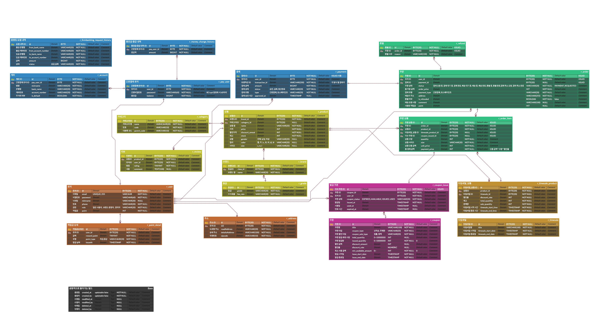

# 🐿 타임세일 쿠폰 이커머스 프로젝트

> 팀 **그대가 기다리던 가을이 왔네요** 🍂


## 목차

- [🍁 실행 방법](#-실행-방법)
- [🍁 개발 환경](#-개발-환경)
- [🍁 상세 개발 환경](#-상세-개발-환경)
- [🍁 프로젝트 목표](#-프로젝트-목표)
- [🍁 프로젝트 주요 기능](#-프로젝트-주요-기능)
- [🍁 ERD](#-erd)
- [🍁 인프라 구조](#-인프라-구조)


## 🍁 구성원

| 이름                                  | 역할 분담    |
|-------------------------------------|----------|
| [김재윤](https://github.com/yunjae62) | 결제       |
| [조원호](https://github.com/wonowonow) | 쿠폰, 타임세일 |
| [윤선미](https://github.com/hgalchi)   | 유저, 브랜드  |
| [박현도](https://github.com/atto08)    | 주문       |


## 🍁 실행 방법

1. 아래의 환경 변수 설정
    ```dotenv
    ```
    - `구성 편집` -> `빌드 및 실행` -> `옵션 수정` -> `환경 변수` 선택 -> 환경 변수에 아래의 형식으로 작성
    - `키1=값1;키2=값2`
2. 프로젝트에 맞게 [docker-compose.yml](./docker-compose.yml) 수정
3. 도커 실행
4. 스프링 실행
    - `docker compose support` 라이브러리가 자동으로 컨테이너를 실행 및 종료합니다.
  

## 🍁 개발 환경

| 분류         | 상세                                  |
|------------|:------------------------------------|
| IDE        | IntelliJ                            |
| Language   | Java 21                             |
| Framework  | Spring Boot 3.3.4                   |
| Repository | PostgreSQL 16.4, H2 In-memory(Test) |
| Build Tool | Gradle 8.8                          |
| Infra      | EC2, Docker, Github Actions         |


## 🍁 상세 개발 환경

### Dependencies

- Spring WebMVC
- Spring Validation
- Spring Security
- Spring Data Jpa
- Spring Data Redis
- Spring Batch 5.1.2
- jjwt 0.12.6
- QueryDSL 5.0.0
- mapStruct 1.5.5.Final
- Lombok
- JUnit
- Swagger 2.6.0
- Jacoco


## 🍁 프로젝트 목표

> 대규모 트래픽에도 안정적인 쿠폰 발급 및 재고 관리가 가능한 MSA 이커머스 프로젝트 입니다.

### **대규모 트래픽 대응**

- MSA 아키텍처, Redis, Kafka로 대규모 트래픽 안정적 처리
- 주요 API 처리량 200.0/sec 이상 달성
- 동시성 문제 없는 안전한 서비스
- 부하 테스트

### **배포 및 운영**

- Docker로 일관된 배포 구현
- Github Actions, Docker Hub로 CI/CD 적용

### **모니터링 시스템 구축**

- Prometheus, Grafana로 실시간 메트릭 모니터링


## 🍁 프로젝트 주요 기능

### **Redis 및 Kafka를 통한 비동기 쿠폰 발급, 동시성 처리**

- 대용량 트래픽을 수용하기 위한 비동기 쿠폰 발급
- Redis의 Lua Script로 동시성 제어 및 쿠폰 발급 상태 관리

### **Saga 패턴을 이용한 주문 처리**

- 독립적 트랜잭션으로 각 서비스 통신 관리
`상품 재고확인 & 차감` → `쿠폰 사용 확인 & 상태 변경` → `적립금 사용 확인 & 차감`
- 오류 발생 시 Saga(Choreography) 패턴으로 자동 롤백, 데이터 일관성 유지

### **Redis를 활용한 상품 최저가 조회**

- 상품의 실시간 최저가 제공
- 짧은 TTI와 TTL갱신으로 리소스를 절약, 캐시 효율성 향상

### **Spring Batch 5를 활용한 결제 정산**

- 특정 시간에 자동으로 대량 결제 데이터 처리, 대규모 트랜잭션 최적화
- `결제 완료 데이터 조회` → `수수료 차감` → `정산결과 저장`


## 🍁 ERD



- [ErdCloud](https://www.erdcloud.com/d/gFbEC7pAWKgESGTy8)


## 🍁 인프라 구조


